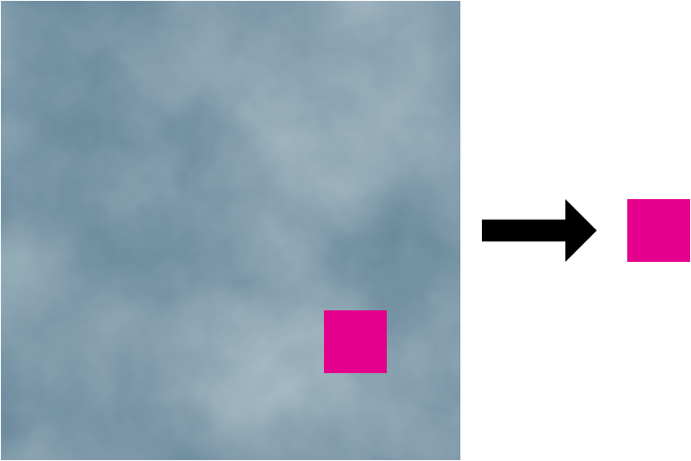
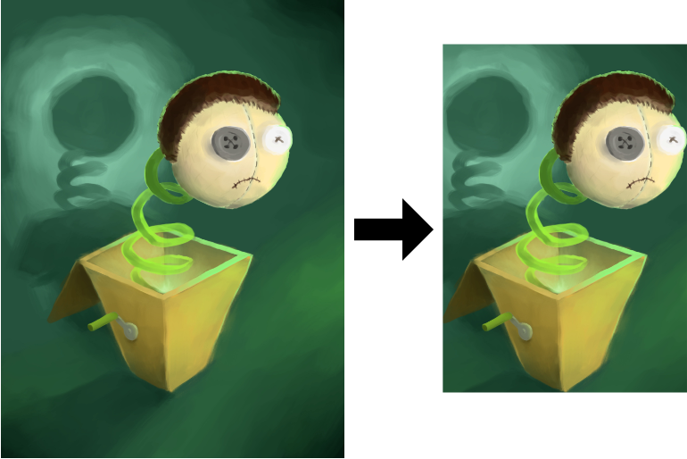

# autocrop

[](https://godoc.org/github.com/mandykoh/autocrop)
[](https://goreportcard.com/report/github.com/mandykoh/autocrop)
[](https://travis-ci.org/mandykoh/autocrop)

`autocrop` is an automatic image cropping/region-of-interest finding implementation in Go.

`autocrop` uses an energy-based approach to determine regions of visual interest at which to stop cropping. Cropping is alpha channel aware and supports images with translucency.

`autocrop` currently assumes image data is sRGB encoded.

See the [API documentation](https://godoc.org/github.com/mandykoh/autocrop) for more details.

Some examples of cropping decisions made by `autocrop` can be seen here:

_Threshold 0.3_



_Threshold 0.1_



_Threshold 0.15_


This software is made available under an [MIT license](LICENSE).


## Example usage

Find the autocropped bounds of an image using [`BoundsForThreshold`](https://godoc.org/github.com/mandykoh/autocrop#BoundsForThreshold):

```go
croppedBounds := autocrop.BoundsForThreshold(img, energyThreshold)
```

The `energyThreshold` is a value between 0.0 and 1.0 which determines at what energy level cropping stops, relative to the maximum energy of the image. Higher threshold values result in more aggressive cropping.

The [`ToThreshold`](https://godoc.org/github.com/mandykoh/autocrop#ToThreshold) function can be used to conveniently get a cropped image if you don’t need the bounds:

```go
croppedImg := autocrop.ToThreshold(img, energyThreshold)
```

## Command line tool

`autocrop` also provides a command line tool that can be installed as follows:

```
$ go install github.com/mandykoh/autocrop/cmd/autocrop
```

and used to crop images like this:

```
$ autocrop <input_image> <output_png> [threshold]
```

The threshold is optional and defaults to 0.1.
